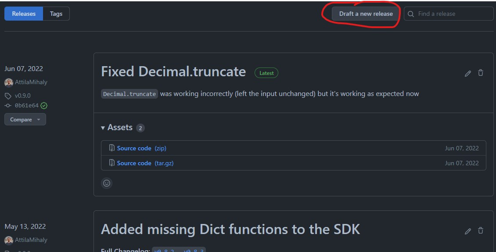
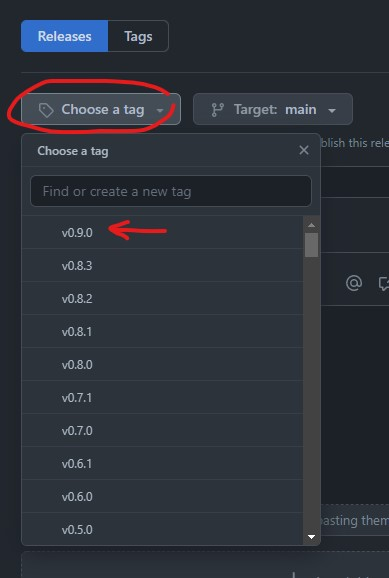
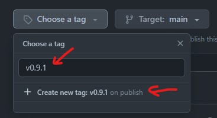
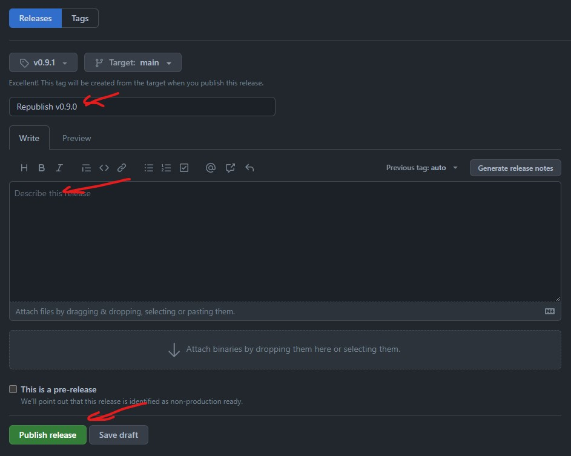
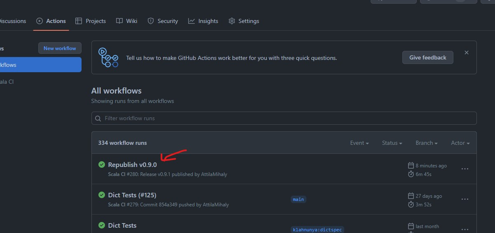

# Creating a new Release

The release of this repo is automated through GitHub actions. To trigger a new release you have to use the GitHub Releases page to create a new release. Here's how that's done step-by-step:

1. Go to the Releases tab under the `finos/morphir-jvm` repo. Click on "Draft a new release": 
2. Click on the "Choose a tag" dropdown to find the latest release: 
3. Come up with the next version number based on the changes that were added: 
4. Add release details and click "Publish release": 
5. GitHub Action will automatically be triggered. When the job completes it will be published to Maven: 
